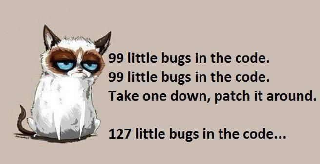
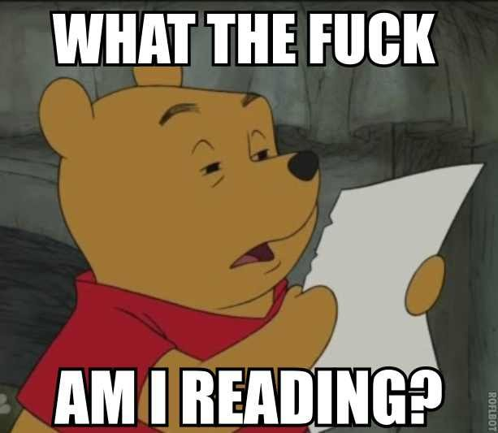

```ruby
include FooCafe

author = Presenter.new(:buren)
slides = MigratingLegacy::Slides.new

wait until author.ready?

author.present(slides) do |slide|
  print slide
  any_questions? if slide.last?
end
```

_Goto_: http://jacobburenstam.com/migrating-legacy


---

# GOTO

## [jacobburenstam.com/migrating-legacy](http://jacobburenstam.com/migrating-legacy)

---

<div data-poller="js-poll-pizza">
  <p>Who wants pizza?</p>
  <button data-answer>Yes</button>
  <button data-answer>Yes, veg</button>
  <button data-answer>Yes, vegan</button>
  <button data-answer>Naa, I'm good</button>
  <hr>
  <div data-chart data-refresh="5"></div>
</div>

---

<div data-poller="js-poll-worked-with-legacy">
  <p>Who here have worked with a legacy code base?</p>
  <button data-answer>Legacy</button>
  <button data-answer>Beginner</button>
  <button data-answer>Legacy-ish</button>
  <button data-answer>Naa</button>
  <button data-answer>Legacy what???</button>
  <hr>
  <div data-chart data-refresh="5"></div>
</div>

---

<div data-poller="js-poll-where-did-you-have-legacy">
  <p>Where did/do you have the most "legacy"?</p>
  <button data-answer>Backend &lt;-&gt; Frontend</button>
  <button data-answer>Backend</button>
  <button data-answer>Frontend</button>
  <hr>
  <div data-chart data-refresh="5"></div>
</div>

---

<div data-poller="js-poll-where-do-you-battle-most-legacy">
  <p>How do you battle legacy?</p>
  <button data-answer>Rewrite</button>
  <button data-answer>More code</button>
  <button data-answer>Refactor</button>
  <button data-answer>I don't</button>
  <hr>
  <div data-chart data-refresh="5"></div>
</div>

---

## Agenda

1. Talk....... :zzz:
  - Please interupt me!
2. Code :thumbsup:

---

### Disclaimer

* My on __personal__ opinions, __not__ the opinions of my employer.
* Your mileage may vary (a lot)

---

## Jacob Burenstam

* Open source tinkerer
* Useless code enthusiast
* Work @ Trialbee

<hr>

* [github.com/buren](https://github.com/buren)
* [keybase.io/buren](https://keybase.io/buren)

---

# Legacy code

:chart_with_downwards_trend: :smoking: :pill: :hocho: :gun: :bomb:

---

## Definition?

Legacy code has many definitions:

* Code for `{outdated|obsolete}` systems that is kept for `{compatibility|legal|SLA}` reasons
* Code written by another person who don't maintain it anymore
* Code without test (Micheal Feathers)

---

## Legacy code in images


---


---



---


---



---


---


---

### Keep it simple stupid!


---

### Legacy code..

> "... A __large part__ of the task of a software engineer is to continually alter code to prevent this."

- Wikipedia

```note
Note the "A large part".
```

---

## Many ways to battle legacy code

* There is no silver bullet
* Be pragmatic, __*very*__ pragmatic

---

## Michael Feathers on improving legacy code

1. Identify change points
2. Find an inflection point (a small interface)
3. Cover the inflection point
  - Break external dependencies
  - Break internal dependencies
  - Write tests
4. Make changes
5. Refactor the covered code.

---

## Inspiration

> "The functional core and the imperative shell"

- Gary Bernhardt

[https://www.destroyallsoftware.com/talks/boundaries](https://www.destroyallsoftware.com/talks/boundaries)

---

Remember the code from the first slide?

```ruby
include FooCafe

author = Presenter.new(:buren)
slides = MigratingLegacy::Slides.new

wait until author.ready?

author.present(slides) do |slide|
  print slide
  any_questions? if slide.last?
end
```

---

```ruby
DEADLINE = Time.new(2015, 10, 14, 18, 0, 0).freeze
module FooCafe;end
module FooCafe::MigratingLegacy;end
String.class_eval { define_method(:last?) { false } }
NilClass.class_eval { define_method(:last?) { true } }
define_method(:wait) { puts 'Still not ready..';sleep 3 }
define_method(:any_questions?) { puts 'Any questions?' }
define_method(:feedback) { puts 'Feedback?' }
class FooCafe::Presenter < Struct.new(:name)
  define_method(:ready?) { Time.now >= DEADLINE }
  def present(slides); slides.to_a.each { |slide| yield(slide) };end
end
class FooCafe::MigratingLegacy::Slides
  define_method(:initialize) { @slides = File.read('slides.md').split('---') }
  define_method(:to_a) { @slides + [nil] }
end
```

This actually makes the previous code work :trollface:

---

* [http://git.io/vnWsf](http://git.io/vnWsf)


---

## Slides available on
### https://github.com/buren/migrating-legacy


---

# Questions?

## github.com/buren
## keybase.io/buren


---

### Build your own ingrations?

### Use some existing library?

---

## React backend integrations

* Python
  - https://github.com/reactjs/react-python
  - https://github.com/markfinger/python-react
* Meteor
  - https://github.com/reactjs/react-meteor
* Ruby
  - https://github.com/reactjs/react-rails
  - https://github.com/shakacode/react_on_rails
* PHP
   - https://github.com/talyssonoc/react-laravel

---

# Lets look at some code

:mag: :mag: :mag:

---


<!-- Third party dependencies -->
<script src="js/libs/jquery.js"></script>
<!-- <script src="js/libs/highcharts.js"></script> -->
<script src="https://www.google.com/jsapi"></script>
<script src="js/libs/chartkick.js"></script>

<!-- JavaScript -->
<script src="js/log.js"></script>
<script src="js/resize-hack.js"></script>

<script>
  PollerConfig = { url: 'https://throwawaypoll.herokuapp.com' };
</script>
<script src="js/poller.js"></script>
<script src="js/poller-dom.js"></script>
<script>
  PollerConfig = { url: 'https://throwawaypoll.herokuapp.com' };
</script>
